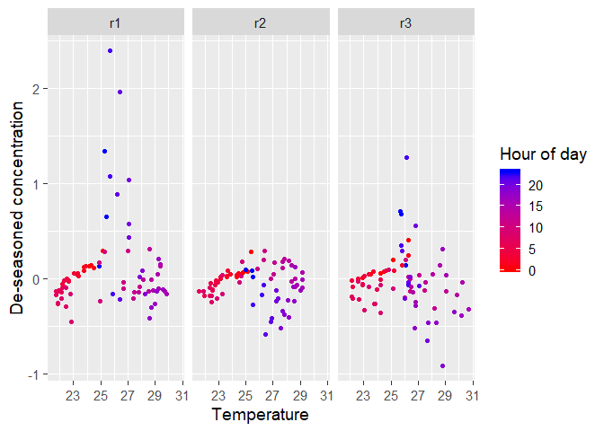

Clustering Analysis
================
Shrikanth
October 18, 2018

``` r
knitr::opts_chunk$set(echo = FALSE)
library(png)
library(grid)
library(quantreg)
```

    ## Loading required package: SparseM

    ## 
    ## Attaching package: 'SparseM'

    ## The following object is masked from 'package:base':
    ## 
    ##     backsolve

``` r
library(highfrequency)
```

    ## Loading required package: xts

    ## Loading required package: zoo

    ## 
    ## Attaching package: 'zoo'

    ## The following objects are masked from 'package:base':
    ## 
    ##     as.Date, as.Date.numeric

``` r
library(TTR)
library(lubridate)
```

    ## 
    ## Attaching package: 'lubridate'

    ## The following object is masked from 'package:base':
    ## 
    ##     date

``` r
library(timeSeries)
```

    ## Loading required package: timeDate

    ## 
    ## Attaching package: 'timeSeries'

    ## The following object is masked from 'package:zoo':
    ## 
    ##     time<-

``` r
library(dplyr)
```

    ## 
    ## Attaching package: 'dplyr'

    ## The following objects are masked from 'package:timeSeries':
    ## 
    ##     filter, lag

    ## The following objects are masked from 'package:lubridate':
    ## 
    ##     intersect, setdiff, union

    ## The following objects are masked from 'package:xts':
    ## 
    ##     first, last

    ## The following objects are masked from 'package:stats':
    ## 
    ##     filter, lag

    ## The following objects are masked from 'package:base':
    ## 
    ##     intersect, setdiff, setequal, union

``` r
library(ggplot2)
library("gridExtra")
```

    ## 
    ## Attaching package: 'gridExtra'

    ## The following object is masked from 'package:dplyr':
    ## 
    ##     combine

``` r
library("cowplot")
```

    ## 
    ## Attaching package: 'cowplot'

    ## The following object is masked from 'package:ggplot2':
    ## 
    ##     ggsave

``` r
theme_set(theme_grey())
library(reshape2)
library(scales)
source("src/TSA_source.R")
source("TSA_Data_Source.R")
source("src/plotting_functions.R")
```

    ## corrplot 0.84 loaded

    ## 
    ## Attaching package: 'plotrix'

    ## The following object is masked from 'package:scales':
    ## 
    ##     rescale

Extraction
==========

``` r
C_data <- read.csv(file = 'Raw Sensor Data/Climo_co_corr_IISc_1_10.csv', header = TRUE, sep = ";")
cTime <-  as.POSIXct(C_data$Time)#(,"%Y-%m-%d %H:%M:%S", tz = "")
ws_c <- as.numeric(mean(diff(cTime)))*60 # sampling frequecy (seconds)
xts.c <- xts(x = C_data$Value, order.by = cTime)


daily_threshold <- floor(1170) # Expected number of samples per day
frequency_tolerance.c = 10
frequency_tolerance.w = 10
fault_window = "hours" # to identify faults in the data
std_tolerance = 0.01
dir.create("plots",showWarnings=FALSE,recursive=TRUE)
```

Main dataframe
--------------

``` r
avg_time = 1

# df.new <- get_ts_master_dataFrame('Raw Sensor Data/Wind_direction_corr_IISc_1_20.csv', 
#                               'Raw Sensor Data/Climo_co_corr_IISc_1_10.csv', 
#                               'Raw Sensor Data/Wind_speed_corr_IISc_1_20.csv', 
#                               avg_time)
df.new <- getMasterdf_September(avg_time)
refTime <- as.POSIXct(df.new$time)
df.seasonal <- getSeasonality(df.new, avg_time)
# Plot overall time series
plot.TS_Overall(xts.c, type = "CO Concentrations",folder = "plots")
```


``` r
# Plot Dataframe with fautly rows in red
plot.DF_faults(df.new,df.specs = "Carbon Monoxide", avg_time, folder = "plots")
```


Clustering
==========

We can now perform the numerous tests by clustering the dataset into three major regions.

Clustering based on dates
-------------------------


Seasonality in each cluster
---------------------------


Effect of wind speed on de-seasoned data
----------------------------------------

``` r
folder = "plots"
df.specs = "Scat_onset_ws_deseasoned_clust"
plot.Scat_ws_deseasoned(df.new, df.seasonal, df.specs, avg_time, clustering = TRUE)
```


Effect of temperature on de-seasoned data
-----------------------------------------

``` r
df.specs = "Scat_t_deseasoned_clust"
plot.Scat_t_deseasoned(df.new, df.seasonal, df.specs, avg_time, clustering = TRUE)
```



Histogram for temperature
-------------------------


Histogram for Wind speed
------------------------


