Time Series Analysis for Climo with Wind Data
================

Extraction
==========

``` r
C_data <- read.csv(file = 'Raw Sensor Data/Climo_co_corr_IISc_1_10.csv', header = TRUE, sep = ";")
cTime <-  as.POSIXct(C_data$Time)#(,"%Y-%m-%d %H:%M:%S", tz = "")
ws_c <- as.numeric(mean(diff(cTime)))*60 # sampling frequecy (seconds)
xts.c <- xts(x = C_data$Value, order.by = cTime)


daily_threshold <- floor(1170) # Expected number of samples per day
frequency_tolerance.c = 10
frequency_tolerance.w = 10
fault_window = "hours" # to identify faults in the data
std_tolerance = 0.01
dir.create("plots",showWarnings=FALSE,recursive=TRUE)
```

Main dataframe
--------------

``` r
avg_time = 1

# df.new <- get_ts_master_dataFrame('Raw Sensor Data/Wind_direction_corr_IISc_1_20.csv', 
#                               'Raw Sensor Data/Climo_co_corr_IISc_1_10.csv', 
#                               'Raw Sensor Data/Wind_speed_corr_IISc_1_20.csv', 
#                               avg_time)
df.new <- getMasterdf_September(avg_time)
refTime <- as.POSIXct(df.new$time)

# Plot overall time series
plot.TS_Overall(xts.c, type = "CO Concentrations",folder = "plots")
```


``` r
# Plot Dataframe with fautly rows in red
plot.DF_faults(df.new,df.specs = "Carbon Monoxide", avg_time, folder = "plots")
```

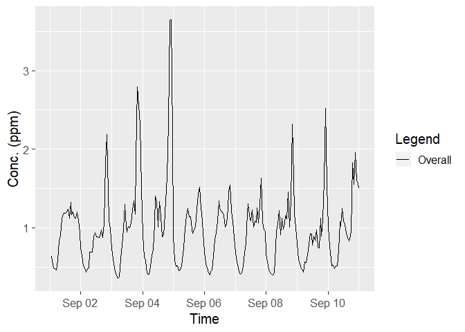

-   Concentrations without corresponding wind speed and wind direction is highlighted in red.

``` r
df.new.clean <- df.new[complete.cases(df.new), ]
df.new.1 <- df.new[df.new$wos==1, ] 
```

Wind Directions after 5min Downsampling
---------------------------------------

``` r
xts.ds.w <- xts(df.new.1$wdir, order.by = refTime[1:length(df.new.1$wdir)])
plot(xts.ds.w, main = paste("Wind Directions Downsampled by ",as.character(avg_time*60),"min",sep=""))
```

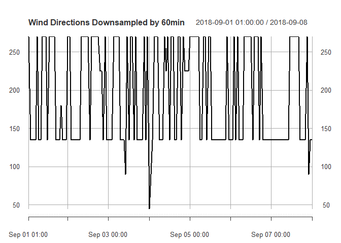

5 minute Downsampling
---------------------

``` r
hist(df.new$wdir, main = "Histogram of wind directions", xlab = "Angle w.r.t to North")
```


Temperature
-----------

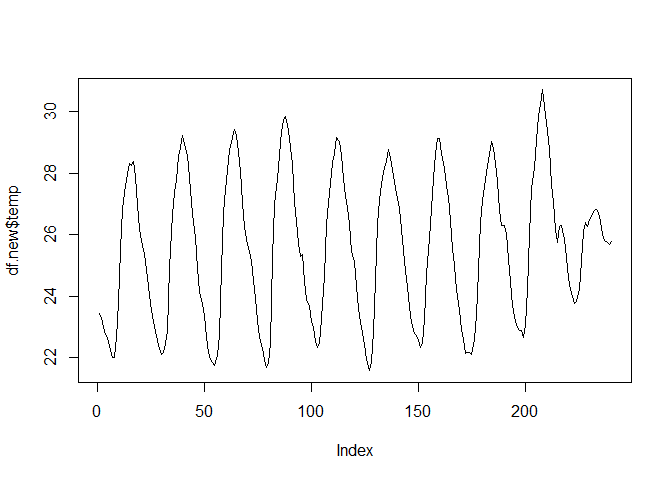

Seasonality from August dataset
===============================

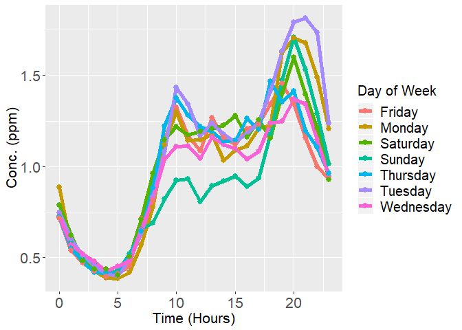


Quantile plots
--------------

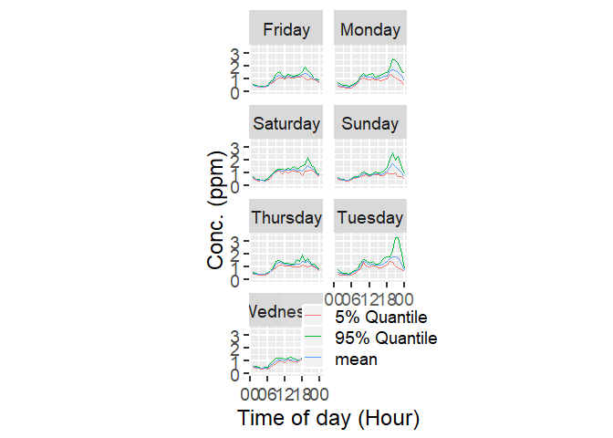

Effect of Wind Speed
====================

Effect of wind Speed on Concentrations
--------------------------------------

``` r
# df.new <- get_ts_master_dataFrame(sample.wd, sample.c, sample.ws, avg_time)
# refTime <- as.POSIXct(rownames(df.new))
df.seasonal <- getSeasonality(df.new, avg_time)
# Plots the daily seasonality w.r.t wind speed and wind direction
plot.DF_Seasonal_c_ws(df.seasonal, "Seasonal_plot_test", avg_time, "plots")
```

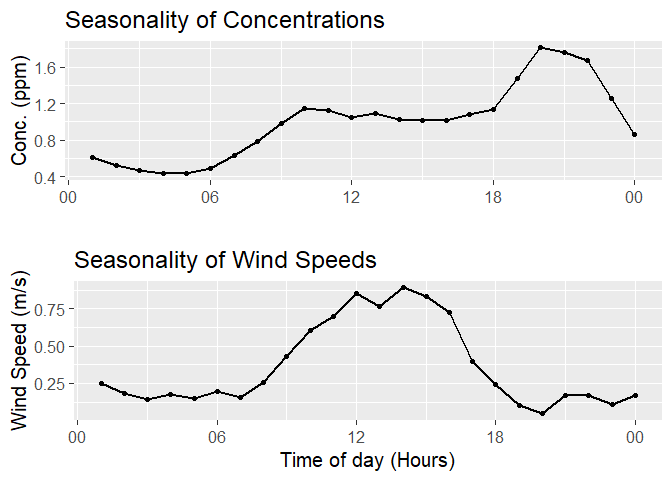

-   With seasonality, the concentration observed has no bearing on the wind speed as observed from 18:00 to 00:00 hours.

Correlation of concentration with wind speed
--------------------------------------------

``` r
folder = "plots"
df.specs = "Corr_ws_c"
plot.Corr_ws_c(df.seasonal, df.specs, avg_time)
```


Effect of wind speed on de-seasoned data
----------------------------------------

``` r
folder = "plots"
df.specs = "Scat_ws_deseasoned"
plot.Scat_ws_deseasoned(df.new, df.seasonal, df.specs, avg_time)
```

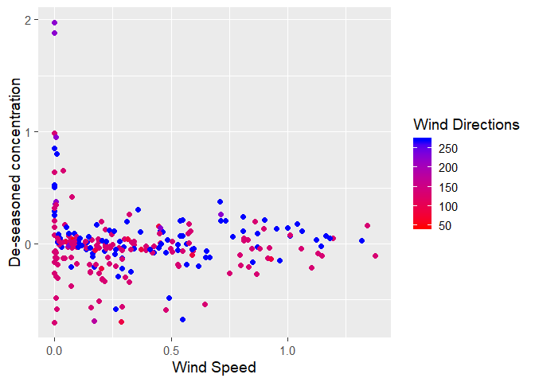

Effect of wind direction on concentration
=========================================

Concentration vs Wind Direction
-------------------------------

``` r
plot.Hist_conc_wd(df.new, df.specs, avg_time)
```

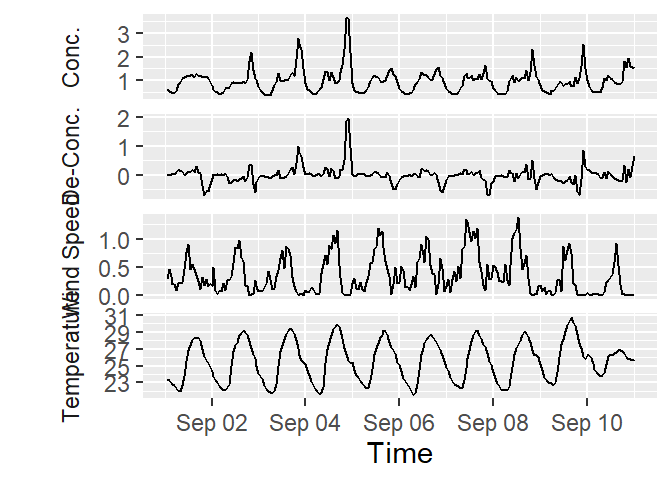

Concentration vs Wind Direction
-------------------------------

``` r
# df.new.clean <- df.new[complete.cases(df.new), ]
tmp <- avg_time
avg_time <- 1/6
df.new <- getMasterdf_September(avg_time)
plot.conc_ws_on_wd(df.new, df.specs, avg_time)
```

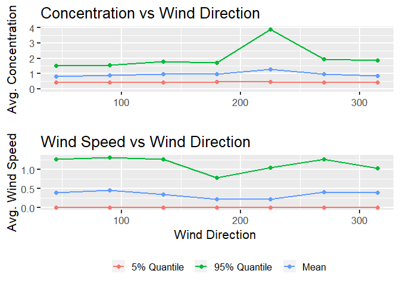

``` r
avg_time <- tmp
```

-   Wind directions 90<sup>∘</sup> and 315<sup>∘</sup> result in similar concentrations despite having higher wind speeds.

Effect of Wind Direction on de-seasoned data
--------------------------------------------

``` r
# avg_time = 1

df.seasonal <- getSeasonality(df.new, avg_time)

plot.scat_ws_decon(df.new, df.seasonal, df.specs, avg_time)
```

    ## Warning: Removed 18 rows containing missing values (geom_point).

    ## Warning: Removed 18 rows containing missing values (geom_point).

    ## Warning: Removed 18 rows containing missing values (geom_point).


Analysis with Variance and Concentration
========================================

Noise variance and concentration characteristic for Climo
---------------------------------------------------------

``` r
plot.NV_conc_char(df.new, df.seasonal, df.specs, avg_time)
```

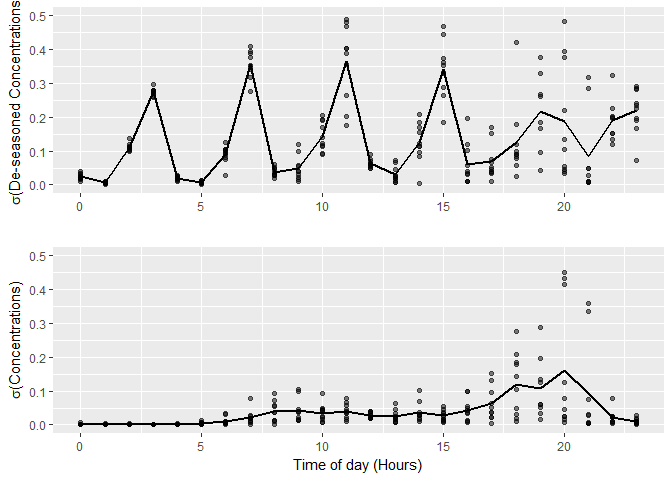

Average of deseasoned concentrations conditioned by wind speed
--------------------------------------------------------------

``` r
plot.conc_on_ws(df.new, df.seasonal, df.specs, avg_time)
```

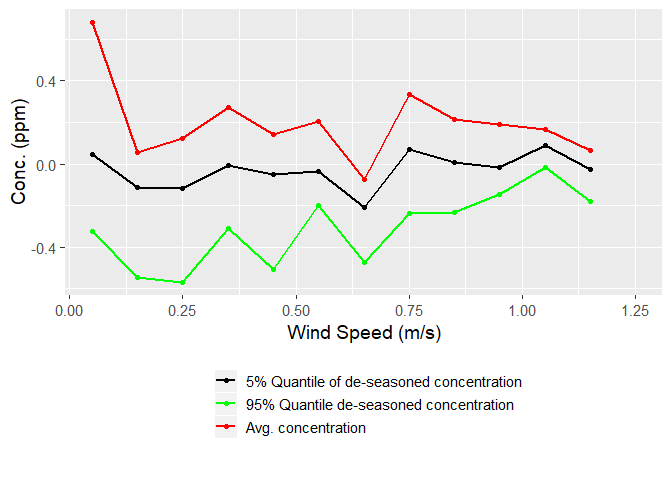

Z-score(Conc) vs Z-score(Wind speed) from 9AM to 6PM
----------------------------------------------------

``` r
plot.Zconc_Zws(df.new, df.specs, avg_time)
```

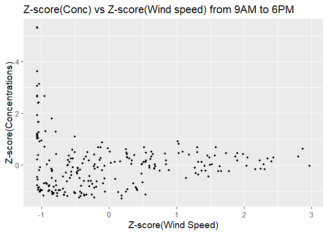

Deseasoning with weekly seasonality
===================================

``` r
# avg_time= 1/12
# 
# df.new <- getMasterdf_September(avg_time)

df.sea.d <- getSeasonality(df.new, avg_time)
df.sea.w <- getSeasonalData_August(avg_time)

plot.scat_ws_wdecon(df.new, df.sea.d,df.sea.w, avg_time)
```

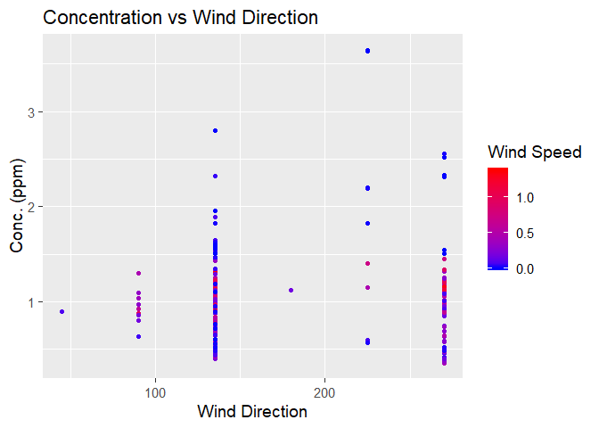

Effect of Temperatute
=====================

Seasonaltiy with concentration and temperature
----------------------------------------------

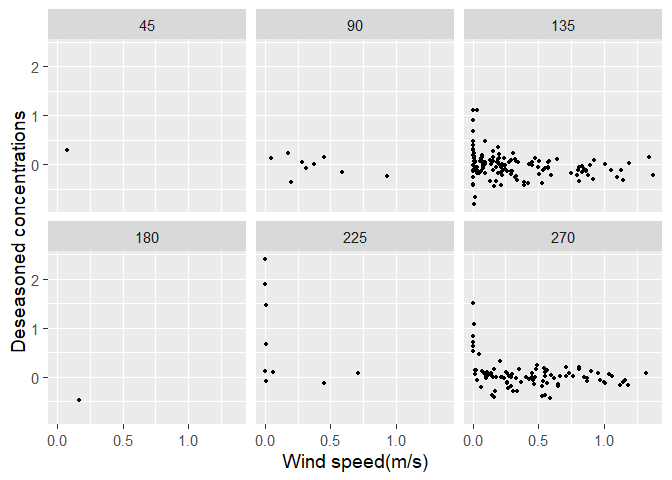

Correlation of concentration with temperature
---------------------------------------------

``` r
folder = "plots"
df.specs = "test"
plot.Corr_t_c(df.seasonal, df.specs, avg_time)
```

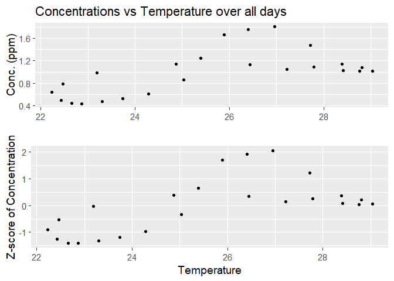

Effect of temperature on de-seasoned data
-----------------------------------------

``` r
plot.Scat_t_deseasoned(df.new, df.seasonal, df.specs, avg_time)
```

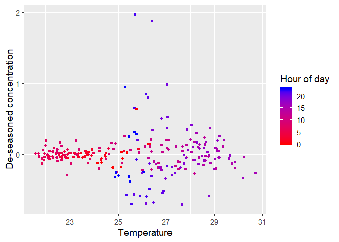
